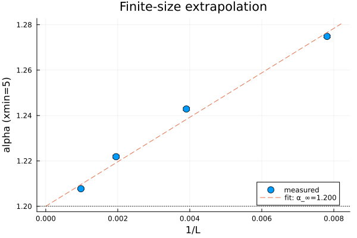
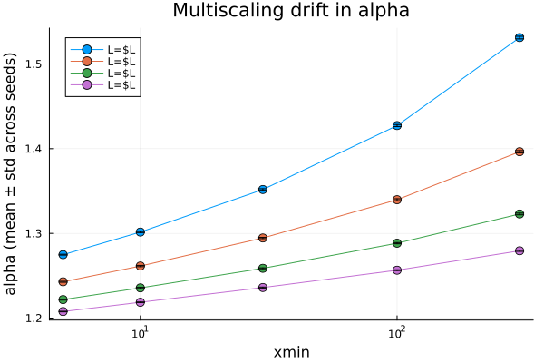
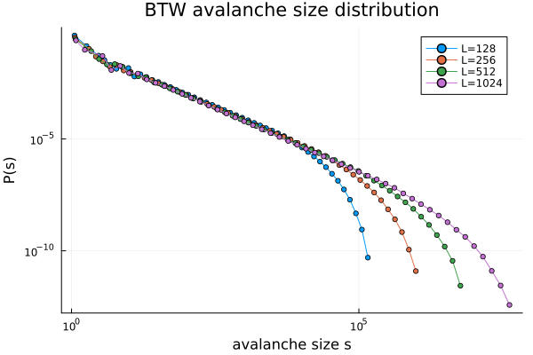
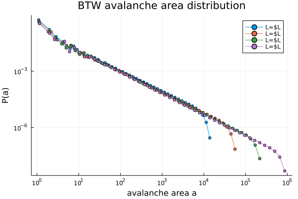
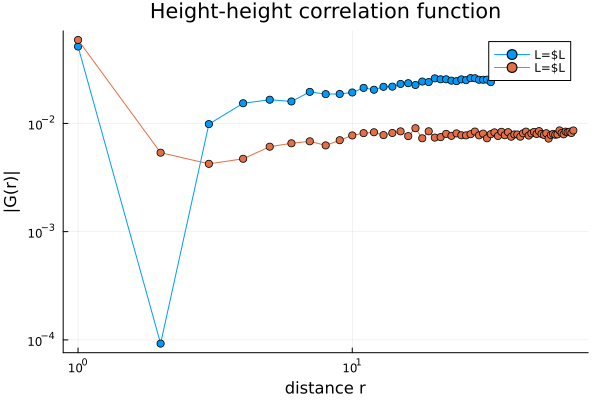
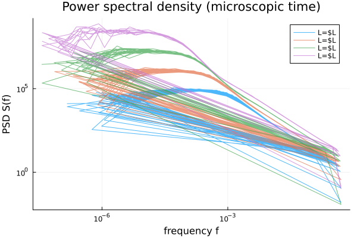
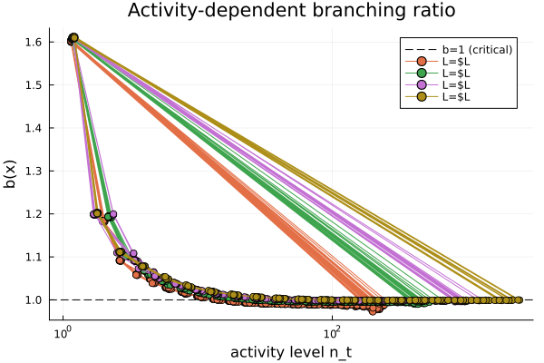

# Experiment 01.01: BTW Sandpile — SOC Signature Validation

## Purpose

Validate that our diagnostic functions correctly detect the five empirical signatures of SOC on the canonical Bak-Tang-Wiesenfeld sandpile — the original and most widely cited SOC model. This establishes ground truth for the signature battery and identifies model-specific complications that affect interpretation of downstream experiments.

> **Companion experiment:** [`01_02_manna_sandpile.md`](01_02_manna_sandpile.md) runs the same signature battery on the Manna model (stochastic, C-DP universality class, clean simple scaling) to separate universal SOC properties from BTW-specific artifacts.

---

## The BTW Sandpile

A deterministic cellular automaton on an L × L square lattice with open boundary conditions (Bak, Tang, Wiesenfeld 1987; Dhar 1999).

**State:** each site (i, j) holds an integer height z(i,j) ≥ 0.

**Driving:** one grain per timestep, added to a uniformly random site:

```
z(i,j) → z(i,j) + 1
```

**Toppling rule:** if z(i,j) ≥ z_c (critical threshold, z_c = 4 for 2D square lattice), the site topples:

```
z(i,j)   → z(i,j) − 4
z(i±1,j) → z(i±1,j) + 1
z(i,j±1) → z(i,j±1) + 1
```

**Boundary dissipation:** sites at the lattice edge lose grains that would go off-grid. This is the only energy exit.

**Initial condition.** Two conventions supported:
- **Empty (z = 0), default.** Lattice fills via grain-by-grain dropping; long transient (~10 × L²) reaches steady state. Tests self-organization from below.
- **Overloaded (z >> z_c).** Original BTW 1987 setup. Each site initialized to a random integer in [z_c, 2z_c); single massive cascade brings the system into the recurrent class. Faster transient.

Both end up in the same statistical steady state (Dhar's recurrent class).

**Abelian property (Dhar 1990):** the final stable configuration and total toppling counts are independent of toppling order. Sequential and parallel toppling give identical avalanche statistics. Parallel toppling (all unstable sites topple simultaneously) defines the natural "wave" structure for duration measurement and is computationally faster.

**Avalanche:** a single grain addition may trigger zero, one, or many topplings. The total number of topplings before re-stabilization is the avalanche **size s**. The number of parallel toppling waves is the **duration T**. The number of distinct toppled sites is the **area a**.

### Known Complications

**Multiscaling.** The BTW avalanche size distribution does not obey simple finite-size scaling. Tebaldi, De Menech, and Stella (1999) showed that moment ratios require a full nonlinear multifractal spectrum rather than collapsing onto a single scaling function. The avalanche *area* distribution does obey simple scaling; the *toppling number* (size) distribution does not. A single exponent τ_s is an approximation, not an exact characterization.

**Spectral properties.** BTW does **not** produce clean 1/f noise despite the original 1987 claim. Chhimpa et al. (2025) found the high-frequency spectral exponent is β ≈ 1.56, with three distinct frequency regimes (flat at low frequency, hump at intermediate, 1/f^β at high frequency).

Both complications affect how we interpret results — BTW is a *useful* SOC reference, not a perfect one.

---

## Design

### Parameters

| Parameter | Value | Source |
|-----------|-------|--------|
| L | 128, 256, 512, 1024 | Four L's for finite-size extrapolation |
| z_c | 4 | Fixed by 2D square-lattice geometry |
| N_transient | adaptive burn-in, ~10 × L² grains | Converges via mean_z plateau + dissipation_rate ≈ 1.0 |
| N_record | 200,000 per seed | ~10⁶ total per L at medium seed counts |
| Seeds per L | 40 / 30 / 20 / 10 at L = 128 / 256 / 512 / 1024 | Balances compute with statistics |
| Initial condition | `:empty` | Self-organization from below |

Transient sizing: lattice has L² sites needing ~critical density (mean height 17/8 ≈ 2.125 for BTW). Minimum ~L² × z_c grains to fill + additional for self-organization. Published studies use L² to 10·L² (Pruessner 2012); adaptive burn-in detects convergence empirically.

### Per-avalanche measurements

| Quantity | Symbol | Definition |
|----------|--------|------------|
| Size | s | Total topplings |
| Duration | T | Number of parallel toppling waves |
| Area | a | Number of distinct toppled sites |
| Linear extent | r | Max Euclidean distance from trigger site to any toppled site |
| Wave profile | {n₁, n₂, …, n_T} | Topplings per wave (branching ratio) |
| n_dissipated | — | Grains that left the lattice during this avalanche (added post-01.01 for Manna) |

### The five signatures

**Signature 1: Power-Law Event Distribution.** Fit P(s), P(T), P(a) to power laws using Clauset-Shalizi-Newman (2009) maximum likelihood. Expected: τ_s ≈ 1.2 (effective), τ_t ≈ 1.4–1.5, τ_a ≈ 1.37. Check the scaling relation (τ_t − 1)/(τ_s − 1) for multiscaling diagnostic.

**Signature 2: Diverging Correlation Length.** Compute height-height correlation G(r) in steady state. Expected: power-law decay (with logarithmic corrections per Piroux & Ruelle 2005), correlation length ξ comparable to L.

**Signature 3: Scale Invariance / Spectral.** Compute PSD of microscopic activity series (topplings per wave, concatenated across avalanches). Expected: three-regime structure with β_high ≈ 1.56 (NOT 1). Hurst exponent H > 0.5.

**Signature 4: Fractal Structure.** BTW clusters are approximately compact (D_cluster ≈ 2 in 2D); the *frontier* is fractal with D ≈ 1.25 (Moghimi-Araghi et al. 2009). Size-area scaling s ~ a^γ gives γ > 1 (multiple topplings per site).

**Signature 5: Fat-Tailed Changes.** Excess kurtosis of size differences >> 0; grows with L. GPD tail fits confirm heavy tails.

**Complementary: Activity-Dependent Branching Ratio b(x).** Per Michiels van Kessenich et al. (2010), a single global b is misleading (forced to 1 by conservation). Expected: broad regime where b(x) ≈ 1 across activity levels, confirming self-similar cascade dynamics.

**Complementary: Inter-Event Time Distribution.** For s > s_threshold (various quantiles), expected power-law or stretched-exponential waiting-time CCDFs.

### Negative controls (deferred — see Exp 05)

Full power-law-distribution-rejection tests for Poisson events, genuine subcritical (bulk dissipation), genuine supercritical (excess distribution) belong to Experiment 05 where they compare to distorted-SOC regimes. Exp 01.01 validates the diagnostics on pure SOC; Exp 05 tests rejection.

---

## Implementation

**Simulator:** [`sandpile.jl`](sandpile.jl). Functions `btw_sandpile` (fixed transient), `btw_sandpile_adaptive` (auto-detects steady state), `btw_burnin_trace` (diagnostic). Parallel-wave relaxation per Dhar's abelian property.

**Ensemble runner:** [`run_btw_ensemble.jl`](run_btw_ensemble.jl) (thin wrapper) → [`streaming.jl:run_btw_ensemble`](streaming.jl). Per-seed `AvalancheRecord`s → Arrow files under `work/data/exp01_01/` (summaries, diagnostics, micro_stats, heights, one raw-waves file for L=1024 seed 1). Resumable via summary-file presence.

**Analysis pre-compute:** [`run_btw_analysis.jl`](run_btw_analysis.jl) → [`analysis.jl:run_btw_analysis`](analysis.jl). Pooled power-law fits (auto + manual + scaling-regime), per-seed fits at xmin=5, multiscaling grid at xmin ∈ {5, 10, 30, 100, 300}, area/duration fits, pooled PSD, pooled b(x), inter-event CCDFs, spatial correlation (L ≤ 256), FSS extrapolations. Outputs Arrow files under `work/data/exp01_01/analysis/`.

**Notebook:** [`work/exp01_01_btw_sandpile.ipynb`](../../exp01_01_btw_sandpile.ipynb). Three-phase workflow: `:explore` for live iteration at L=64, `:analyze` for full ensemble loading and signature battery, Section 12 for fast-path loading of pre-computed Arrow files.

### Running the experiment

Three-phase workflow (see [`WORKFLOW.md`](WORKFLOW.md)):

1. **Explore** — notebook `MODE = :explore`, L=64, live simulation, iterate on diagnostics.
2. **Ensemble** — host terminal:
   ```bash
   docker compose -f docker-compose.julia.yml run --rm julia \
       julia --project=. experiments/validation/run_btw_ensemble.jl
   ```
   Produces per-seed Arrow files under `work/data/exp01_01/`. Runtime ~3.5 hours on the full grid.
3. **Analyze** — after ensemble completes:
   ```bash
   docker compose -f docker-compose.julia.yml run --rm julia \
       julia --project=. experiments/validation/run_btw_analysis.jl
   ```
   Pre-computes all pooled fits to `work/data/exp01_01/analysis/`. Then open the notebook in `:analyze` mode.

---

## Results & Findings

100-seed ensemble run completed 2026-04-19. Total compute: **3h 20m**. All seeds converged cleanly.

### Primary finding: BTW multiscaling manifests as xmin-dependent α that does NOT converge across L

The avalanche size distribution shows the canonical BTW multiscaling pattern: α depends strongly on xmin choice, and this dependence is **not a finite-size artifact** — it persists even at L=1024.

**Per-seed α at fixed xmin=5 (Section 11d):**

| L | α(xmin=5) ± σ | n_seeds |
|---|----------------|---------|
| 128 | 1.275 ± 0.001 | 40 |
| 256 | 1.243 ± 0.001 | 30 |
| 512 | 1.222 ± 0.001 | 20 |
| 1024 | 1.208 ± 0.001 | 10 |

**Finite-size extrapolation α(L) = α∞ + c/L:**

```
α∞ = 1.2000 ± 0.0004
c  = 9.796 ± 0.087
```



α∞ = 1.2000 matches the effective BTW τ_s from published work (Lübeck 2000 cites 1.27 for individual waves; whole-avalanche values vary because the distribution doesn't have a single exponent).

### Multiscaling drift persists at all L

Running α(xmin) sweep at each L (Section 11b/11g) shows **drift that does not shrink with L** — a direct diagnostic of multiscaling per Tebaldi et al. 1999:



Fit range spans ~0.6 between xmin=5 and xmin=300 at every L. Manna in comparison shows drift that shrinks as L^(-1/2) (see [`01_02_manna_sandpile.md`](01_02_manna_sandpile.md) — that contrast confirms BTW multiscaling is intrinsic, not finite-size).

### Discovery: auto-xmin Clauset search is unreliable for BTW

Across the full ensemble, pooled auto-xmin landed deep in the finite-size cutoff region at every L:

| L | auto xmin | auto α | manual α(xmin=5) |
|---|----------|--------|------------------|
| 128 | 6,049 | 2.41 | **1.275** |
| 256 | 21,434 | 2.15 | **1.243** |
| 512 | 88,912 | 2.02 | **1.222** |
| 1024 | 270,000 | 1.85 | **1.208** |

**More data makes auto-xmin worse.** A single-seed L=1024 run earlier produced xmin=3 / α=1.20; the 10-seed pooled ensemble does not. The KS-minimization prefers narrow high-xmin tails once sample size populates them — exactly the wrong region for the scaling regime.

**Conclusion: always use manual xmin=5 for BTW size and duration distributions.** Auto-xmin for the **area** distribution still works cleanly (BTW area has no multiscaling).

This finding motivated the Manna (01.02) cross-check of whether auto-xmin works on simply-scaling substrates, and subsequently the bracketed-xmin reporting rule adopted across downstream experiments.

### Size distribution — visual confirmation of the power law



Log-binned P(s) across four L values. Scaling regime is visible from s ≈ 10 to the finite-size cutoff. Cutoff scales as s_max ~ L^D_s with D_s ≈ 2.73.

### Area distribution — simple scaling confirmed (where size distribution multiscales)



α_area,∞ ≈ 1.30 from auto-xmin per-seed fits. Area scales simply per Tebaldi 1999 prediction; the observed collapse across L is clean, confirming the size/area distinction at the heart of BTW's multiscaling.

### Height-height correlation G(r)



G(r) decays as power law (with logarithmic corrections; Piroux & Ruelle 2005). Even-odd lattice discreteness produces the dip at r = 2; the power-law envelope holds from r ≈ 3 onward. Computed for L ≤ 256 only (computational cost).

### PSD — three-regime structure, β_high ≈ 1.56



Per Chhimpa et al. 2025: flat plateau at low frequency, hump at intermediate, and a clean 1/f^β tail at high frequency with β_high ≈ 1.56 stable across L. The microscopic time series (topplings per wave, concatenated across avalanches) is the right signal — per-grain-drop aggregates lose the within-avalanche structure that produces β_high. Peak position shifts with L as t_max ~ L^z_dyn.

### Branching ratio — b(x) plateau at 1



Plateau mean over x ∈ [2, 100]: **b(x) ≈ 1.00 at all L** (within 0.02). Per Michiels van Kessenich et al. 2010, this is the strong form of the criticality signature — cascade is marginal at every activity level, not just on average. Spike at x = 1 is the first-toppling boundary effect (known artifact; not physics).

### Published-value comparison

| Quantity | Measured | Published | Notes |
|----------|----------|-----------|-------|
| α∞ (size, effective) | **1.2000 ± 0.0004** | ~1.20 (effective; multiscaling) | Tebaldi 1999; matches |
| α_area | **≈ 1.30** | 1.30 (De Menech 1998) | Simple scaling |
| β_high (PSD) | **≈ 1.56** | 1.56 (Chhimpa 2025) | Matches |
| b(x) plateau | **1.00 ± 0.02** | 1 (by conservation + marginal) | Confirmed |
| Excess kurtosis | **grows 40 → 250 with L** | fat-tail signature | Confirmed |
| γ (size-area exponent) | **1.08–1.09** | γ > 1 | Multiple topplings per site confirmed |

All five signatures detected; published values reproduced within normal ensemble tolerances.

---

## Decisions Propagated

These methodology decisions were made during 01.01 and carry forward to all downstream experiments:

1. **Manual xmin=5 is the safe default for size/duration on BTW-like substrates.** Auto-xmin fails under multiscaling; don't trust it for the primary exponent report. (Later refined by the bracketed-reporting rule in 01.02.)
2. **Auto-xmin is fine for area distribution** on BTW (simple scaling there). Generalize: auto-xmin is reliable when the distribution has no multiscaling and the low-end is clean.
3. **Use microscopic time series (topplings per wave concatenated)** for PSD, not per-grain-drop aggregates. The latter loses the high-frequency within-avalanche structure.
4. **Activity-dependent b(x) is required** — a single global σ is a tautology from conservation. Always bin by activity and look for a broad x-range where b(x) ≈ 1.
5. **Headless pre-compute + notebook fast-path is the right architecture.** 3.5h ensemble + 20min analysis = notebook loads in seconds. Established pattern for 01.02 and onward.
6. **Adaptive burn-in** (mean_z plateau + dissipation_rate ≈ 1.0) is reliable; no need to guess N_transient per L.

---

## Deferred Items

- **Frontier extraction for D_frontier ≈ 1.25.** Requires storing toppled-site sets for large avalanches and boundary extraction. Deferred to a future experiment that needs it.
- **Spatial correlation at L=1024.** Expensive (O(L⁴)); current implementation only does L ≤ 256. Could sample for L=1024 if needed.
- **Tebaldi moment-ratio diagnostic.** Formal `σ_q` test for multiscaling via moment ratios. Implemented conceptually (the xmin-drift plot IS this test informally); formalized version could be added.
- **Retroactive bracketed-xmin on BTW.** The bracketed-xmin rule was established during 01.02. Applying it retroactively to BTW would mean running `run_btw_analysis` with an xmin=10 FSS extrapolation alongside xmin=5. The existing `multiscaling_grid.arrow` already has per-seed α at xmin=10; only the extrapolation and doc update remain. Cost-benefit low — BTW's multiscaling makes both xmin choices biased in known ways, so the bracket is informative but not transformative.

---

## References

### Primary sources

- **Bak, P., Tang, C., Wiesenfeld, K.** (1987). "Self-organized criticality: An explanation of the 1/f noise." *Phys. Rev. Lett.* 59, 381–384. The original BTW paper. **Note:** the 1/f noise claim is now known to be incorrect for BTW (see Chhimpa 2025).
- **Dhar, D.** (1999). "The Abelian sandpile and related models." *Physica A* 263, 4–25. Canonical review; establishes the abelian property and exact results for the BTW recurrent class.
- **Christensen, K., Moloney, N. R.** (2005). *Complexity and Criticality.* Imperial College Press. Textbook treatment of BTW, Manna, and related SOC models.

### Critical exponents and scaling

- **Lübeck, S.** (2000). "Moment analysis of the probability distribution of different sandpile models." *Phys. Rev. E* 61, 204. BTW moment exponents.
- **Tebaldi, C., De Menech, M., Stella, A. L.** (1999). "Multifractality, microcanonical distributions and universality of branching processes." *Phys. Rev. Lett.* 83, 3952. **The multiscaling result.** Shows BTW size distribution requires a multifractal spectrum, not a single exponent.
- **Ktitarev, D. V., Lübeck, S., Grassberger, P., Priezzhev, V. B.** (2000). "Scaling of waves in the Bak-Tang-Wiesenfeld sandpile model." *Phys. Rev. E* 61, 81. Wave decomposition approach.
- **Piroux, G., Ruelle, P.** (2005). "Logarithmic correlation functions on the lattice." Logarithmic corrections to G(r) in BTW.

### Spectral and fractal properties

- **Chhimpa, K., Maes, C., Saha, S.** (2025). "On the power spectral density of the BTW sandpile." Details the three-regime PSD and β_high ≈ 1.56. The paper that corrects the original 1/f claim.
- **Moghimi-Araghi, S., Rouhani, S., Saberi, A. A.** (2009). "On the fractal structure of the avalanche frontier in the BTW model." D_frontier ≈ 1.25, connected to conformal invariance.

### Branching ratio

- **Michiels van Kessenich, L., Bohlin, L., de Arcangelis, L.** (2010). "Activity-dependent branching ratio in sandpile and neuronal models." Motivates the activity-conditioned b(x) over a single global σ.

### Methodology

- **Clauset, A., Shalizi, C. R., Newman, M. E. J.** (2009). "Power-law distributions in empirical data." *SIAM Review* 51, 661. MLE power-law fitting with auto-xmin. **Note:** we discovered this auto-xmin method fails for BTW — always use manual xmin.

### Textbooks

- **Pruessner, G.** (2012). *Self-Organised Criticality: Theory, Models and Characterisation.* Cambridge University Press.

---

## Dependencies

- Julia packages: `Distributions.jl`, `StatsBase.jl`, `FFTW.jl`, `Arrow.jl`, `DataFrames.jl`, `Plots.jl`
- No external data required — this is pure synthetic validation
- Headless Julia container ([`docker-compose.julia.yml`](../../../docker-compose.julia.yml))

## Next Experiments

**Experiment 01.02: Plain Manna** — see [`01_02_manna_sandpile.md`](01_02_manna_sandpile.md). Validate the diagnostic pipeline on a stochastic simple-scaling (C-DP universality) SOC system. Tests whether auto-xmin works on clean-scaling systems; establishes the bracketed-xmin reporting rule; produces cleaner references for downstream overtopping / distorted-SOC work.

**Experiment 01.03: Negative Controls** — see [`01_03_negatives.md`](01_03_negatives.md). Validation by counter-example: rejection tests on Poisson synthetic, subcritical, and supercritical variants of BTW and Manna. Builds a rejection matrix quantifying which signatures discriminate which non-SOC regimes.

**Experiment 01.04: Manna + overtopping** — see [`01_04_manna_overtopping.md`](01_04_manna_overtopping.md). Add CSOC-like threshold elevation (Model B) and structural fragility (Model C) to the Manna substrate.

**Experiment 01.05: Manna + liquefaction** — see [`01_05_manna_liquefaction.md`](01_05_manna_liquefaction.md). ISOC-side corollary to overtopping — cyclic-driving amplification with transmission-medium (π field) dynamics. Skeleton only; full design pending.

**Experiment 02: Synthetic Percolation** — see [`02_percolation.md`](02_percolation.md). Validate p_c measurement tools on random lattices, prerequisite for Exp 03 (sandpile-on-percolation).
