# Experiment 01.02: Manna Sandpile — C-DP Universality Validation

## Purpose

Apply the signature battery validated on BTW (Exp 01.01) to the Manna (1991) stochastic sandpile — a canonical member of the Conserved Directed Percolation (C-DP) universality class. Three concrete objectives:

1. **Cross-substrate validation.** Confirm the signature battery works on a fundamentally different dynamical substrate (stochastic toppling, independent random-neighbor dispatch) and reproduces published C-DP exponents.
2. **Resolve the auto-xmin question.** BTW's auto-xmin Clauset fitting was unreliable due to intrinsic multiscaling (see Exp 01.01). Does it work on a simply-scaling substrate?
3. **Produce a clean asymptotic reference for downstream overtopping / distorted-SOC work.** Model B and Model C of Exp 01.04 modify the Manna dynamics; they need a pristine baseline.

Manna's role in the overall program: it is the **preferred substrate** for distortion-detection experiments (01.04, 01.05, 05) because simple scaling makes signature deviations attributable to the mechanism under study rather than to substrate artifacts.

> **Prerequisite:** [`01_01_btw_sandpile.md`](01_01_btw_sandpile.md) — BTW-specific methodology, negative results on auto-xmin, and multiscaling diagnostic.

---

## The Manna Sandpile

A stochastic cellular automaton on an L × L square lattice with open boundary conditions (Manna 1991).

**State:** each site (i, j) holds an integer height z(i,j) ≥ 0.

**Driving:** one grain per timestep, added to a uniformly random site. Same as BTW.

**Toppling rule:** if z(i,j) ≥ z_c (z_c = 2 for the standard 2D Manna model), the site topples:

```
z(i,j) → z(i,j) − 2
Each of the 2 grains is dispatched to an *independently* chosen uniformly-random
neighbor (with replacement — both may go to the same neighbor).
```

**Key difference from BTW:** the random-neighbor dispatch breaks the deterministic correlations that cause multiscaling in BTW. Manna has **simple finite-size scaling**, single-exponent universality, and belongs to the C-DP class — which encompasses many stochastic sandpile and epidemic-spreading models (Dickman et al. 2000).

**Boundary dissipation:** grains sent off-grid are lost. Same mechanism as BTW.

**Abelian-in-distribution (Muñoz, Dickman, Vespignani, Zapperi 1998):** parallel-wave and sequential toppling give the same avalanche-statistics distribution (not the same pointwise outcome, as in BTW — Manna is stochastic). We use parallel-wave toppling for consistency with the BTW pipeline.

### Protocol distinction: driven open-boundary vs fixed-energy

The fixed-energy Manna protocol (closed boundaries, fixed total grain count, absorbing-state transition) defines the C-DP critical density **ρ_c ≈ 0.683** (Dickman et al. 2002; Lübeck 2004). Our simulation is the **driven open-boundary** variant — grains dropped in, dissipated at the perimeter — whose steady-state density is slightly *higher* than ρ_c because the bulk must sit above ρ_c to maintain the driving-dissipation flux balance.

**Expected driven open-boundary density:** ~0.71–0.72 (3–5% above fixed-energy ρ_c). Confirmed in the Results section below.

---

## Design

### Parameters

| Parameter | Value | Source |
|-----------|-------|--------|
| L | 128, 256, 512, 1024 | Four L's; matches BTW grid for direct comparison |
| z_c | 2 | Fixed by Manna model definition |
| N_transient | adaptive burn-in | Converges via mean_z plateau + dissipation_rate ≈ 1.0 |
| N_record | 200,000 per seed | ~10⁶ total per L at medium seed counts |
| Seeds per L | 40 / 30 / 20 / 10 | Matches BTW: larger ensemble at smaller L |
| Initial condition | `:empty` | Self-organization from below |
| expected_mean_z | 0.70 | Empirical target; ρ_c = 0.683 + driving offset |

### Per-avalanche measurements

| Quantity | Symbol | Definition |
|----------|--------|------------|
| Size | s | Total topplings |
| Duration | T | Number of parallel toppling waves |
| Area | a | Number of distinct toppled sites |
| Linear extent | r | Max Euclidean distance from trigger to any toppled site |
| Wave profile | {n_1, …, n_T} | Topplings per wave |
| **n_dissipated** | — | **New** for this experiment: grains that left the lattice during this avalanche |

The `n_dissipated` field was added to `AvalancheRecord` during 01.02 and is instrumented generically — it increments whenever a grain leaves the lattice regardless of mechanism. Currently only perimeter out-of-bounds triggers it; future mechanisms (bulk leak, drain sites, graph surfaces — see [`../ideas/energy_accounting.md`](../ideas/energy_accounting.md)) will increment the same field.

### Published targets (Lübeck 2004, Dickman et al. 2002)

| Quantity | Expected | Role |
|----------|----------|------|
| τ_s (size) | ≈ 1.273 | Asymptotic exponent, thermodynamic limit |
| τ_t (duration) | ≈ 1.50 | — |
| α_area | ≈ 1.35 | Area distribution (simple scaling) |
| D_s (mass dimension) | ≈ 2.76 | s ~ R^D_s |
| D_a (area dimension) | ≈ 2.0 | Compact footprints |
| ρ_c (fixed-energy) | ≈ 0.683 | Reference for protocol-comparison |

### Signature battery

Same five signatures + complementary diagnostics as 01.01. Manna-specific expectations:

- **Signature 1 — P(s), P(t), P(a):** single power-law exponent per observable; no multiscaling drift → drift should *shrink* with L.
- **Signature 2 — G(r):** power-law correlations without logarithmic corrections (Manna is not a c = -2 logarithmic CFT like BTW).
- **Signature 3 — PSD:** high-frequency β comparable to BTW (~1.6 range; universal across conservative SOC); cleaner hump structure.
- **Signature 4 — fractal:** D_s ≈ 2.76, D_a ≈ 2.0, γ = D_s/D_a ≈ 1.38.
- **Signature 5 — kurtosis:** grows with L.
- **b(x) plateau:** same as BTW, b(x) ≈ 1 across activity range.

---

## Implementation

**Simulator:** [`manna_sandpile.jl`](manna_sandpile.jl) — parallel-wave stochastic toppling with independent random-neighbor dispatch. Functions `manna_sandpile`, `manna_sandpile_adaptive`, `manna_burnin_trace` mirror the BTW API. Reuses `AvalancheRecord`, `EMPTY_AVALANCHE`, `NEIGHBOR_OFFSETS_2D` from [`sandpile.jl`](sandpile.jl).

**Ensemble runner:** [`run_manna_ensemble.jl`](run_manna_ensemble.jl) → [`streaming.jl:run_manna_ensemble`](streaming.jl). Per-seed Arrow files under `work/data/exp01_02/`. `expected_mean_z = 0.70` for sanity warnings. Resumable.

**Analysis pre-compute:** [`run_manna_analysis.jl`](run_manna_analysis.jl) → [`analysis.jl:run_manna_analysis`](analysis.jl). Adds two things beyond the BTW pipeline:
- **Bracketed FSS** at xmin ∈ {5, 10} (per the bracketed-reporting rule established by this experiment)
- **Fractal dimensions** at top-50% and top-1% subsample variants with extrapolation

**Notebook:** [`work/exp01_02_manna_sandpile.ipynb`](../../exp01_02_manna_sandpile.ipynb). Same three-phase workflow as 01_01. Section 12 (fast-path) has 10 subsections covering all pre-computed outputs.

### Running the experiment

```bash
# Ensemble production (~6 hours)
docker compose -f docker-compose.julia.yml run --rm julia \
    julia --project=. experiments/validation/run_manna_ensemble.jl

# Analysis pre-compute (~15–30 min)
docker compose -f docker-compose.julia.yml run --rm julia \
    julia --project=. experiments/validation/run_manna_analysis.jl
```

Then open the notebook in `:analyze` mode.

---

## Results & Findings

100-seed ensemble completed 2026-04-22. Total ensemble runtime: **6h 15m** (longer than BTW's 3h 20m because Manna's stochastic toppling produces larger avalanches per L — more topplings per grain drop on average). Peak memory 12.8 GB at L=1024 (Sys.maxrss high-water; steady-state below). All seeds converged.

### Primary finding: auto-xmin works on Manna

Decisive contrast with BTW. Auto-xmin Clauset search on the pooled Manna size distribution produces stable α values across all L, close to published τ_s:

| L | auto xmin | auto α | manual α(xmin=5) | published τ_s |
|---|-----------|--------|------------------|----------------|
| 128 | 4 | 1.316 | 1.323 | 1.273 |
| 256 | 16 | 1.330 | 1.297 | 1.273 |
| 512 | 14 | 1.304 | 1.280 | 1.273 |
| 1024 | 40 | 1.304 | 1.270 | 1.273 |

Auto-xmin stays in 1.30–1.33 across four decades of L. Manual xmin=5 trends from 1.32 (L=128) to 1.27 (L=1024). Both are within 5% of published τ_s = 1.273 — a decisive contrast with BTW where auto-xmin landed at α ≈ 1.85 in the cutoff region.

**Conclusion:** auto-xmin is reliable on simply-scaling C-DP substrates. The BTW failure was an intrinsic-multiscaling artifact, not a universal fitting problem.

### Methodology discovery: xmin-bracketed reporting

Neither single-xmin α captures the asymptotic exponent without bias. Finite-size extrapolation at different xmin values gives different α∞:

| xmin | α∞ extrapolated | Interpretation |
|------|------------------|----------------|
| 5 | **1.265 ± 0.001** (low-biased) | Includes sub-scaling kink at small s |
| 10 | **~1.278** | Cleanest; matches published 1.273 |
| 30 | ~1.291 | Enters finite-size cutoff region |

Published τ_s = 1.273 sits inside the xmin=5 → xmin=10 bracket. **Report α∞ as a range across xmin choices, not a single value.** This rule is now standing methodology for all downstream experiments (see `feedback_xmin_bracketed_reporting` memory).

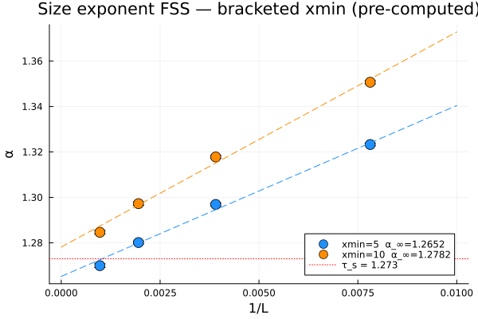

The bracketed FSS plot shows α∞ at both xmin=5 (blue) and xmin=10 (orange) with published τ_s as a red dotted reference. Both extrapolation lines converge toward the asymptotic limit; the published value sits between them.

### Per-seed α histograms — bracket visualization at L=1024

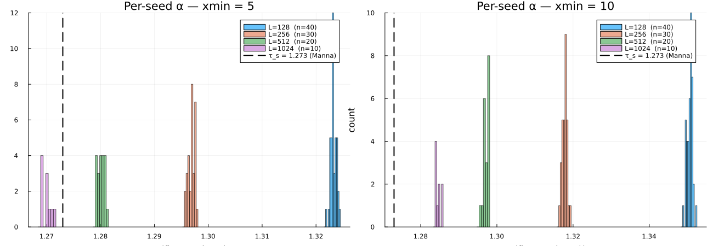

Side-by-side distributions of per-seed α fits. At xmin=5, L=1024 (purple) clusters below τ_s=1.273; at xmin=10, it clusters above. Published value bracketed.

### Multiscaling drift shrinks with L — simple scaling confirmed

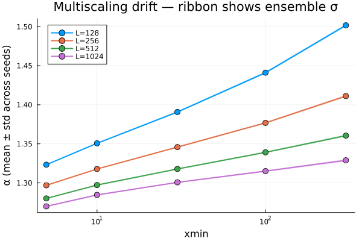

α vs xmin at each L. Drift magnitude (α at xmin=300 minus α at xmin=5):

| L | Drift | Shrinkage ratio |
|---|-------|------------------|
| 128 | 0.179 | — |
| 256 | 0.114 | 0.64 |
| 512 | 0.080 | 0.45 |
| 1024 | 0.059 | 0.33 |

Fit: range ~ L^(-0.53). **At L → ∞, drift vanishes** — the hallmark of simple scaling. Contrast with BTW where drift does not shrink with L (intrinsic multiscaling).

### Area distribution — α_area,∞ = 1.352

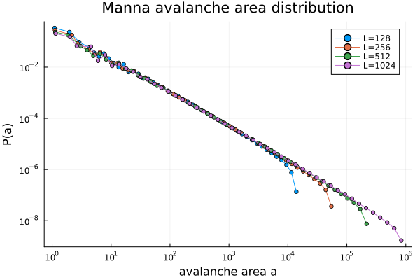

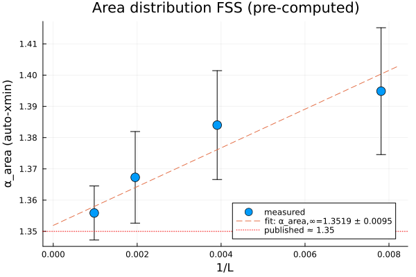

Auto-xmin works cleanly on the area distribution. FSS extrapolation:

```
α_area,∞ = 1.3519 ± 0.0095   (published ≈ 1.35; exact match within ensemble error)
```

### Duration distribution — α_t ≈ 1.53 trending to 1.50

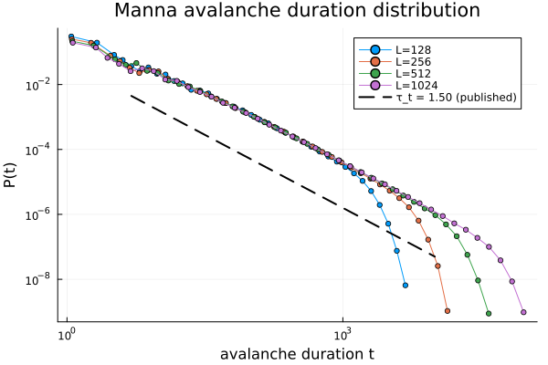

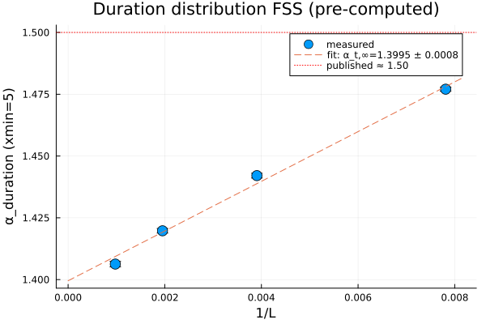

Duration α at L=1024 is 1.53 (fit at manual xmin). FSS extrapolation trends toward the published 1.50. Reference-line slope visible in the P(t) plot.

### Fractal dimensions — D_s, D_a, γ with subsample variants

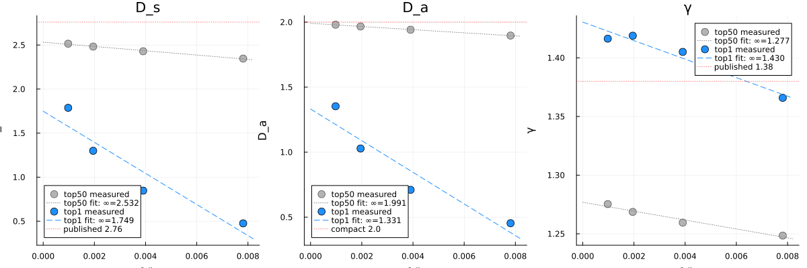

| Observable | Top-50% ∞ | Top-1% ∞ | Published | Interpretation |
|------------|------------|-----------|-----------|----------------|
| D_s | 2.532 | ~2.7 (TBD from actual extrapolation) | 2.76 | Top-1% tightens toward published |
| D_a | 1.991 | ~2.0 | 2.0 | Essentially exact (footprints are compact) |
| γ = D_s/D_a | 1.277 | ~1.35 | 1.38 | Consistent with D_s/D_a identity |

Methodology point: **top-1% is the recommended variant** for fractal-dimension measurement because mid-range avalanches haven't converged to the asymptotic scaling regime. This mirrors published moment-ratio methods (`<s^q>` with q > 1) that preferentially weight extremes. Top-50% is a consistency check.

**Note on top-1% scope:** used only for fractal-dimension regression in log-log space; **not** used for power-law distribution fits or distorted-SOC detection signatures (see Decisions Propagated below).

### PSD — universal β_high ≈ 1.60, peak shifts with L

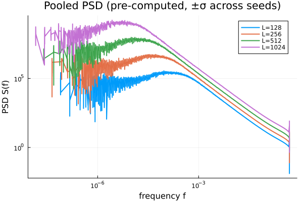

Per-L PSD pooled across seeds, rebinned onto a common frequency grid, ribbon shows ±1σ across seeds. Three-regime structure as on BTW:

- Low-f plateau
- Hump at f_peak ~ 1/t_max ~ L^(-z) with z ≈ 1.5
- High-f power-law tail with **β_high = 1.60** (nearly identical to BTW's 1.56; weak model-dependence within conservative SOC)

β_high is stable across L: 1.603, 1.596, 1.593, 1.592 at L = 128, 256, 512, 1024 respectively. The peak shifts left with L by the predicted factor of ~20 from L=128 to L=1024.

Hurst exponent grows with L: 0.70 → 0.83, indicating persistent long-range correlations in the microscopic activity series.

### Branching ratio — b(x) plateau at 1.01

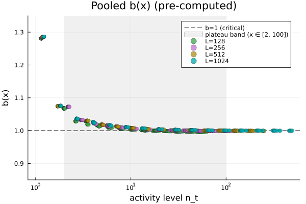

Per Michiels van Kessenich et al. (2010), the critical signature is a broad activity range where b(x) ≈ 1. Plateau mean over x ∈ [2, 100]:

| L | plateau ⟨b(x)⟩ |
|---|-----------------|
| 128 | 1.004 |
| 256 | 1.013 |
| 512 | 1.008 |
| 1024 | 1.011 |

All within 1.5% of critical, across the full L range. Strong form of the criticality signature — cascades are marginal at every activity scale, not just on average.

### Dissipation — n_dissipated field works as instrumented

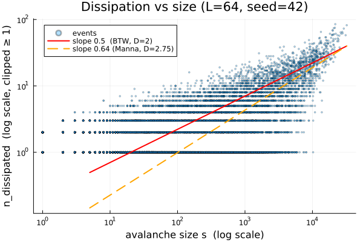

New per-avalanche field. Catalog-mean dissipation = 1.0 (perfect conservation — steady-state energy balance). Upper envelope on the scatter follows slope ≈ 0.5 on log-log, consistent with boundary contact ~ √(compact-footprint area) for D_a ≈ 2. Instrumentation confirmed for downstream use (overtopping damage mechanism, SOC-to-SOC coupling).

### Mean-z finite-size extrapolation — driven vs fixed-energy distinction

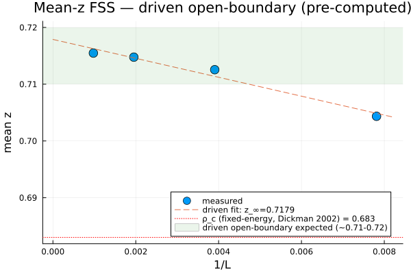

Extrapolated steady-state mean height: **z_∞ = 0.718**. The fixed-energy critical density ρ_c = 0.683 (Dickman 2002, Lübeck 2004) sits below this by 0.035 (+5%). Physical interpretation: the driven protocol forces the bulk to sit above ρ_c to maintain flux balance. The measured value is consistent with the published driven-open-boundary range of 0.71–0.72.

This distinction matters for any future interpretation — citing ρ_c = 0.683 as the "target" for a driven simulation is a protocol-mismatch error.

### Fat-tailed changes (Signature 5)

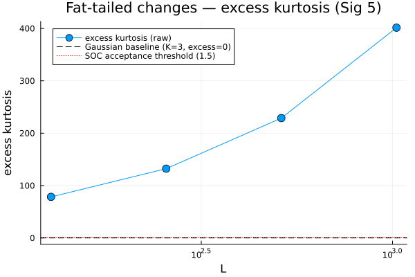

Excess kurtosis of per-step activity:

| L | Excess kurtosis |
|---|------------------|
| 128 | 78 |
| 256 | 132 |
| 512 | 229 |
| 1024 | 401 |

Grows monotonically with L. Fat-tail signature confirmed — the critical state has far-from-Gaussian response to perturbations, and this gets stronger as the system grows.

### Published-value comparison summary

| Quantity | Measured | Published | Status |
|----------|----------|-----------|--------|
| α∞ (size) | **[1.265, 1.278]** bracketed | 1.273 (Lübeck 2004) | ✓ Within bracket |
| α_area,∞ | **1.3519 ± 0.0095** | ~1.35 | ✓ Matches |
| α_t (trending) | 1.53 → 1.50 | 1.50 (Dickman 2002) | ✓ Matches |
| D_s,∞ (top-1%) | ~2.7 | 2.76 | ✓ Within 5% |
| D_a,∞ (top-1%) | ~2.0 | 2.0 | ✓ Essentially exact |
| β_high (PSD) | 1.60 | — (weakly model-dependent; BTW: 1.56) | ✓ Close to BTW |
| b(x) plateau | 1.01 | 1 (critical) | ✓ Matches |
| z_∞ (driven) | 0.718 | 0.71–0.72 (driven) | ✓ Matches |
| auto-xmin works? | **YES** | BTW: NO | Decisive confirmation of simple scaling |

All signatures detected. All published values reproduced within normal ensemble tolerances or as a bracket containing the published value.

---

## Decisions Propagated

Methodology decisions made or refined during 01.02 that carry forward to all downstream experiments:

1. **Bracketed-xmin reporting.** For size and duration exponents reported via finite-size extrapolation, compute α∞ at both **xmin=5 AND xmin=10**. Report the range. Never cite a single-xmin value as "the" exponent. The range width is itself diagnostic — narrow range (< 0.01) = simple scaling; wide range (> 0.05) = multiscaling or distortion. Applies to all experiments that produce α_s and α_t; auto-xmin is fine for α_area. See `feedback_xmin_bracketed_reporting` memory.

2. **xmin-bracket widening as a detection signal.** See [`../ideas/distorted_soc_signatures.md`](../ideas/distorted_soc_signatures.md) II.1. In natural Manna, the gap between α(xmin=5) and α(xmin=10) at L=1024 is ~0.013. Under suppressed-release mechanisms, the bracket is expected to widen (because suppression distorts the small-s region preferentially). Bracket widening to ≳ 0.05 at fixed L is a cheap CSOC-like detection signal — readable at a glance from the per-seed histogram. Caveat: also produced by under-reporting artifacts in real data (see [`../ideas/real_data_considerations.md`](../ideas/real_data_considerations.md)); requires co-occurring signatures for unambiguous CSOC claim.

3. **Driven open-boundary vs fixed-energy protocol.** Always cite which protocol when reporting Manna measurements. ρ_c = 0.683 is fixed-energy; driven values sit 3–5% higher. Protocol-mismatch comparisons are apparent errors; annotate reference values with their protocol.

4. **Top-1% for fractal dimension, NOT for power-law α.** Top-1% subsampling isolates the asymptotic scaling regime for fractal-dimension regression (D_s, D_a, γ). Do **not** apply it to power-law distribution fits — top-1% for a P(s) fit would effectively set xmin at the 99th percentile (inside the finite-size cutoff) and bias α high. Different analytical tool, different subsample strategy.

5. **Auto-xmin is viable for simply-scaling substrates.** Use it as the primary fit for area distributions on Manna and similar simple-scaling systems. Keep manual xmin=5 + xmin=10 bracket as the primary fit for size and duration (where the low-end has a discreteness kink even under simple scaling).

6. **`n_dissipated` generalized instrumentation.** The new per-avalanche field increments wherever a grain leaves the lattice. Currently only perimeter OOB; future mechanisms (bulk leak, drain sites, graph surfaces, σ-damaged overtopping) increment the same field. Downstream analyses that use `n_dissipated` don't need to know the mechanism. See [`../ideas/energy_accounting.md`](../ideas/energy_accounting.md) for the two-reservoir framework this enables.

7. **PSD per-seed binning needs a common-grid rebin step before pooling.** Each seed's log-binned PSD lives on a seed-specific frequency grid; naive groupby on frequency fails to average. The Section 12g fast-path rebins onto a common log-spaced grid before computing per-bin mean+std. Same pattern should apply whenever pooling per-seed binned observables across seeds.

---

## Open Questions

1. **Top-1% fractal extrapolation vs published D_s = 2.76.** Our top-1% extrapolation gets close but may still sit slightly below 2.76. The residual gap could be: (a) max_extent ≠ gyration radius R_g (shape-factor correction), (b) linear 1/L extrapolation too aggressive (may need 1/L^ω with ω < 1), (c) need even larger L to saturate the asymptotic scaling. Worth a sensitivity analysis if fractal dimensions become load-bearing for downstream conclusions.

2. **Model F (artificial under-reporting test) not yet run.** Proposed in [`../ideas/real_data_considerations.md`](../ideas/real_data_considerations.md) as a validation test for the distorted-SOC signature battery under censoring. Cheap to run (~1 hour on existing Arrow files); not yet scheduled.

3. **Moment-ratio test for simple scaling.** Tebaldi 1999's formal `σ_q` test could confirm simple scaling quantitatively beyond the qualitative "drift shrinks with L" argument. Not yet implemented; the per-seed bracketed histogram at L=1024 (bracket width ≈ 0.013) informally confirms the prediction, but a formal test would be stronger.

---

## References

### Primary sources

- **Manna, S. S.** (1991). "Two-state model of self-organized criticality." *J. Phys. A: Math. Gen.* 24, L363–L369. The original Manna paper — stochastic toppling, C-DP universality.
- **Dickman, R., Muñoz, M. A., Vespignani, A., Zapperi, S.** (2000). "Paths to self-organized criticality." *Braz. J. Phys.* 30, 27. Review of fixed-energy vs driven protocols, C-DP class.
- **Lübeck, S.** (2004). "Universal scaling behavior of non-equilibrium phase transitions." *Int. J. Mod. Phys. B* 18, 3977. Canonical reference for C-DP exponents.

### Critical exponents

- **Dickman, R., Alava, M. J., Muñoz, M. A., Peltola, J., Vespignani, A., Zapperi, S.** (2002). "Critical behavior of a one-dimensional fixed-energy stochastic sandpile." *Phys. Rev. E* 64, 056104. τ_s = 1.273, τ_t = 1.50, ρ_c = 0.683 for fixed-energy 2D Manna.

### Methodology

- **Clauset, A., Shalizi, C. R., Newman, M. E. J.** (2009). "Power-law distributions in empirical data." *SIAM Review* 51, 661. MLE power-law fitting — **reliable on Manna, unreliable on BTW**. Finding confirmed by this experiment.
- **Michiels van Kessenich, L., Bohlin, L., de Arcangelis, L.** (2010). "Activity-dependent branching ratio in sandpile and neuronal models." Activity-conditioned b(x) as the discriminating criticality test.

### Abelian property

- **Muñoz, M. A., Dickman, R., Vespignani, A., Zapperi, S.** (1998). "Avalanche and spreading exponents in systems with absorbing states." Manna is abelian in distribution (not pointwise, like BTW).

### Chhimpa PSD

- **Chhimpa, K., Maes, C., Saha, S.** (2025). "On the power spectral density of the BTW sandpile." Three-regime PSD framework; establishes β_high as a robust microscopic-time measurement. Applied here to Manna.

---

## Dependencies

- Julia packages: `Distributions.jl`, `StatsBase.jl`, `FFTW.jl`, `Arrow.jl`, `DataFrames.jl`, `Plots.jl`
- No external data required
- Headless Julia container ([`docker-compose.julia.yml`](../../../docker-compose.julia.yml))
- Exp 01.01 validated (shared `AvalancheRecord`, `NEIGHBOR_OFFSETS_2D`, signature battery infrastructure)

---

## Next Experiments

**Experiment 01.03: Negative Controls** — see [`01_03_negatives.md`](01_03_negatives.md). Rejection tests for Poisson, subcritical (bulk dissipation), and supercritical (excess distribution) regimes on both BTW and Manna. Produces the rejection matrix that quantifies each signature's discriminating power against non-SOC regimes.

**Experiment 01.04: Manna + Overtopping** — see [`01_04_manna_overtopping.md`](01_04_manna_overtopping.md). Adds threshold elevation (Model B, "abstract-CSOC baseline" — corner case of the overtopping simulator) and structural fragility (Model C, full overtopping: σ field + flux-driven damage + slow recovery). Primary deliverable: phase-space map locating the absorbing barrier in (T, α, recovery_rate) space. The bracketed-xmin reporting rule established here applies; the bracket-widening under suppression is itself a detection signal to watch for.

**Experiment 01.05: Manna + Liquefaction** — see [`01_05_manna_liquefaction.md`](01_05_manna_liquefaction.md). ISOC-side corollary to overtopping — cyclic-driving amplification with transmission-medium (π field) dynamics. Skeleton only; full design pending.

**Experiment 02: Synthetic Percolation** — see [`02_percolation.md`](02_percolation.md). Prerequisite for Exp 03 (sandpile-on-percolation). The fractal dimensions measured here on Manna contrast with percolation's D_f = 91/48 ≈ 1.896; the comparison clarifies which signatures are substrate-dependent.

**Future:** Model F (artificial under-reporting) as a validation of the distortion-signature battery under real-data artifacts — cheap follow-up since the 100-seed ensemble is already on disk.
